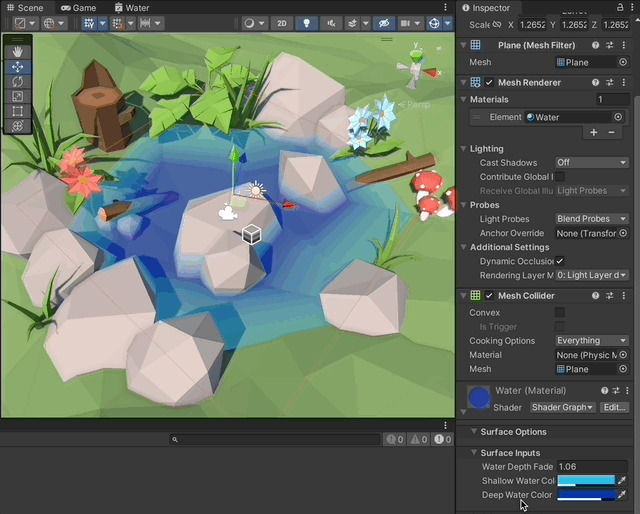
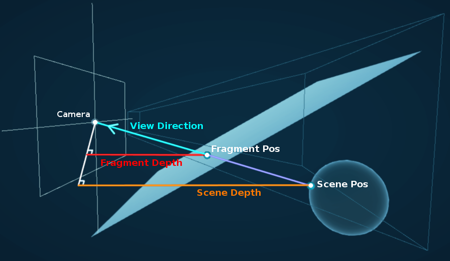

# Water Shader

With Shader Graph in **Unity 2021.3.0f1**

## Fatures

- [Water depth color fade](#water-depth-effect)
- Refraction effect
- Geometry displacement for wave effects
- Foam effect

## Implementation explained

- Use the Universal Render Pipeline
- In the Scriptable Object asset for the Render Pipeline Enable:
  - Depth Texture
  - Opaque Texture
- **Make a Sub Graph that does:**
  - **Scene Depth Node** with Eye sampling (Depth Texture)
  - **Screen Position Node** with Raw mode (Fragment Position)
    - Take just the Aplha channel which contains the Fragment Postion
  - Substract these two to calculate **"Water Depth" = Scene Depth - Fragment Position**
  - Divide by a scaling factor to dynamically adjust the fading color for the water depth via property
  - Finally clamp the value to (0,1) to use it as lerp between two colors (shallow and deep water)
- **Shader for the Water**
  - Make the Shader's Surface Type transparent
  - **Depth color fade**
    - Use the Sub Graph to lerp between two colors (shallow and deep water)
- Create a Material with the Shader and apply it to the Water plane

## Screenshots

### Water depth effect

#### Progress

Water Depth = Scene Depth - Fragment Position

Lerping between the two colors

#### Sub Graph for the depth fade effect

[Sub Graph example by Binary Lunar](https://www.youtube.com/watch?v=MHdDUqJHJxM)

#### Understanding Fragment Depth vs Scene Depth (Depth Texture)

[Depth by Cyanilux](https://www.cyanilux.com/tutorials/depth/#scene-depth-node)

---

### Scene objects setup

Integrating low poly assets from the asset store

[Low-Poly Simple Nature Pack](https://assetstore.unity.com/packages/3d/environments/landscapes/low-poly-simple-nature-pack-162153)

